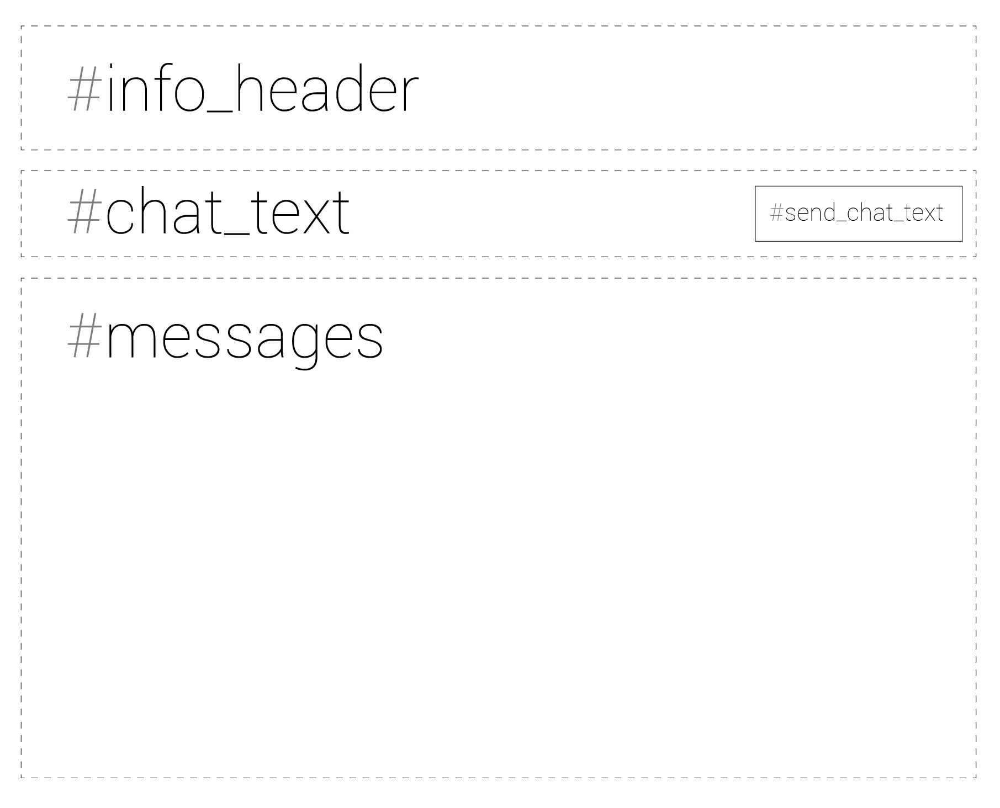

## Introduction

This is a very simple MySQL / PHP 7 based chat application. It contains the following languages: 
#### Front End
* HTML
* CSS3
* jQuery (Client Side)
* Javascript

#### Back End
* PHP 
* MySQL
* jQuery (Sever side)
* Ajax 

### It has the following features: 
* Sign In & Sign Up
* Responsive webdesign
* All forms of error validation
* Recognizes your country while registering, using your IP Address. 
* Very smooth chatting experience
* Group chat
* Can see who all are online 
* Change colors of the chat bubble at your will 

# BACKEND

## Sign In 
The sign in takes plave in the `index.php` page. It has a basic form where you have to enter your username and password, After the username and password is entered. The username and password is `POST-ED` to the same page and the following validation is done on the same page: 

```php
  if(isset($_POST['username']) && isset($_POST['password'])){
    $username = $_POST['username'];
    $password = $_POST['password'];
    $password_hash = md5($password);
    if(!empty($username) && !empty($password)){
      $query = "SELECT `username`,`password` FROM `users` WHERE `username`='$username' AND `password`='$password_hash' ";
      $query_run = mysqli_query($link, $query);
      $userexists = mysqli_num_rows($query_run);
      if($userexists){
        $_SESSION['username'] = $username;
        $query = "UPDATE `users` SET `status`=1 WHERE `username`='$username'";
        mysqli_query($link, $query); 
        header('Location: profile.php');
      }else{
        $error = "Wrong username or password";
      }
    }else{
      $error = "Please fill in the details";
    }
  }
```

As you can see first it checks if the `POSTED` variables are `isset` on line: 
```php
if(isset($_POST['username']) && isset($_POST['password'])){
```
This condition will only be true if there are any variables `POSTED` to this page, Even if the variables are empty this part will be set to true.
Following this code we have: 

```php
$username = $_POST['username'];
$password = $_POST['password'];
$password_hash = md5($password);
```

We set 3 PHP variables, In which the username and password are variables that are posted from the same page. `$password_hash` contains the MD5 crypted version of the password. *I know md5() encryption is depricated, but this was just for a project so I used this. You are free to replace the md5() with any other encryption.* These variables will later be used to validate the user into our chat app. Next we have this condition: 

```php
if(!empty($username) && !empty($password)){
```

As I have mentioned earlier, The function `isset()` wont check if the varibles are empty or not. So we need to write another condition to check if the username and password feilds are left empty. If this contidion is false, `Please fill in the details` will be printed. Now we have checked if the username and password are posted, and also- If they are empty or not. Now we have to check if the username and password entered matches our database (*details about the **database** will be mentioned later*). For that we have to run the following query: 

```php
$query = SELECT `username`,`password` FROM `users` WHERE `username`='$username' AND `password`='$password_hash';
$query_run = mysqli_query($link, $query);
$userexists = mysqli_num_rows($query_run);
```
**NOTE**: The `username and password` is different from `$username and $password`. The ones with the $ in them are PHP variables. The `username and password` in the query are attribute names which we have mentioned in the MySQL Table of the web app. We run this query by 

The variable `$query` stores a MySQL query which is later run suing the `$query_run = mysqli_query($link, $query)` function, When its run we check if the username and password that the user entered matches any username or password in our database. Now the `mysqli_num_rows($query_run)` function will return a `1` or a `0`, It will return `1` if the user exists and `0` if the user doesnt exist. The `mysqli_num_rows($query_run)` just returns the number of rows that have the that username and password. So, you might be thinking what if there are more than 2 users with the same username and password?, That's why we have 'unique' usernames, Which we will talk about in the *Sign Up* page. Now: 

```php
if($userexists){
```

If this condition is true, We have to log the user in. We use the `$_SESSION` variables to log the user in. We use the username as the key to get the users information from the database. 

```php
$_SESSION['username'] = $username;
$query = "UPDATE `users` SET `status`=1 WHERE `username`='$username'";
mysqli_query($link, $query); 
header('Location: profile.php');
```

We run the query `UPDATE users SET status=1 WHERE username='$username'` to show that this user has logged in to the chat application. The `header('Location: profile.php')` function takes the user to the `profile.php` where he / she can talk to anyone who has logged into the app. 

## Profile page

The start of the profile page has: 

```php 
if(!loggedin()){
  header('Location: index.php');
}

$username_logged_in = $_SESSION['username'];
$query = "SELECT * FROM `users` WHERE `username`='$username_logged_in'";
$query_run = mysqli_query($link, $query);
$user_info = mysqli_fetch_assoc($query_run);
$fullname = $user_info['fullname'];
$country_code = $user_info['country_code'];
```
As mentioned before we use ` $_SESSION['username']` as the key to get the users information. 
The profile page mainly has these components: 

The `#info_header` displays the full name, which is taken from the database with the `username` as the key. It has the logout button and also a div that stores some colors, Which can be selected. The `#chat_text` is an `<input type='text'>` which is a text input. The user can enter text and click on `#send_chat_text` to send the message (we will get to that later). The `#messages` is the div that gets refreshed every second (1000 milliseconds) using AJAX (jQuery). Say a user enters a text on the `#chat_text` and clicks on the `#send_chat_text`. The `#send_chat_text` has a javascript function called `send_message()`. 

```javascript
    function send_message(){
      if(window.XMLHttpRequest){
        xmlhttp = new XMLHttpRequest();
      }else{
        xmlhttp = new ActiveXObject();
      }

      var username = "<?php echo $username_logged_in; ?>";
      var fullname = "<?php echo $fullname; ?>";
      var country_code = "<?php echo $country_code; ?>";
      var color = color_selected;
      var message = $('#chat_text').val();

      var get_url = "username="+username+"&fullname="+fullname+"&message="+message+"&color="+color+"&country_code="+country_code;
      console.log(get_url);
      xmlhttp.open('POST','includes/send.inc.php',true);
      xmlhttp.setRequestHeader("Content-type", "application/x-www-form-urlencoded");
      xmlhttp.send(get_url);
      $('#chat_text').val('');
      $('#chat_text').focus();
    }
```
In this function we take the username, fullname, country_code, color and the message and makes a url encoded string out of it. Which is then fed into the xmlhttp object on line: `xmlhttp.send(get_url)`. The line: `xmlhttp.open('POST','includes/send.inc.php',true)` sends a `POST` data to the `send.inc.php` page. The `send.inc.php` file consists of: 
        
```php
  if(isset($_POST['username']) && isset($_POST['fullname']) && isset($_POST['message']) && isset($_POST['color']) /*&& isset($_POST['country_code'])*/){
    $username = $_POST['username'];
    $fullname = $_POST['fullname'];
    $message = $_POST['message'];
    $color = $_POST['color'];
    $country_code = $_POST['country_code'];
    if(!empty($username) && !empty($fullname) && !empty($message) && !empty($color) && !empty($country_code)){
      $query = "INSERT INTO `chats` VALUES('','$username','$fullname','$message','$color','$country_code')";
      mysqli_query($link, $query);
    }
  }
```

The `var get_url = "username="+username+"&fullname="+fullname+"&message="+message+"&color="+color+"&country_code="+country_code` is sent to `send.inc.php` and the all the variables are taken by the `$_POST` method.

```php
$username = $_POST['username'];
$fullname = $_POST['fullname'];
$message = $_POST['message'];
$color = $_POST['color'];
$country_code = $_POST['country_code'];
```

This is how the data is collected from the other page: 

```php
$query = "INSERT INTO `chats` VALUES('','$username','$fullname','$message','$color','$country_code')";
mysqli_query($link, $query);
```

These two lines add all the details to our table. 

Now, If you picture it carefully. We can see what happens everytime you click the send button. The values are taken using javascript and then it's url encoded and send to the `send.inc.php` using the `POST` method, and all the data is collected and uploaded to the database. Now this data which is uploaded is collected back into the `#messages` div *EVERY SECOND*. This is done by using another Javscript function called `get_message()`. Which has the following code: 

```javascript
function get_message(){
  $.ajax({
    url: 'includes/get.inc.php',
    success: function(data){
      $('#messages').html(data);
    }
  });
}
```

This is a jQuery + AJAX code which GETS data from a file named: `get.inc.php`. Which has the following code: 

```php 
  $all_messages = get_messages(30);
  for($i=0; $i<count($all_messages); $i++){
    $username = $all_messages[$i]['username'];
    $fullname = $all_messages[$i]['fullname'];
    $message = $all_messages[$i]['message'];
    $color = $all_messages[$i]['color'];
    $country_code = $all_messages[$i]['country_code'];
    $img_src = "style/images/users/".$username.".png";

    //HTML CONSTRUCTION
  }
```
The `$all_messages` is a variable that called a PHP function `get_messages()` which is placed in another file named `chat.func.php`. The `get_messages()` function has the following code: 

```php
function get_messages($limit){
  global $link;
  $query = "SELECT * FROM `chats` ORDER BY  `msg_id` DESC LIMIT $limit";
  $query_run = mysqli_query($link, $query);
  $all_chats = array();
  while($fetching_chats = mysqli_fetch_assoc($query_run)){
    array_push($all_chats,$fetching_chats);
  }
  return $all_chats;
}
```

This function collects `$limit` number of chats and it returns (`return $all_chats`) all the chats to the variable `$all_messages` (`$all_messages = get_messages(30)`). In this case, 30 latest messages are collected from the database. It's the lastest because we provided `DESC` in the query. Now we know that `$all_messages` is an array that contains all the messages. It takes all the information and then it construct the HTML code which is stored in the `data` variable in the jQuery code. 

**THE HTML CONTRUCTION** this gives the structure to the chat. 

```php 
echo "<div id='message-".($i+1)."' class='each_message'>";
echo "";
echo "<div style='background:".$color.";' class='inner_info'>";
echo "<div class='each_message_fullname'>".$fullname." </div>";
echo "<div class='each_message_text'><i>".$message."</i></div>";
echo "</div>";
echo "</div>";
```

Let's resfresh: 
* Javascript function `get_message()` is called 
* Which gets data from a file `get.inc.php`
* Which runs a PHP function called `get_messages($limit)`
* Which is a function `chat.func.php`
* This function collects `$limit` amount of chats and
* Sends it back to `get.inc.php`
* `get.inc.php` has an array `$all_messages`
* `$all_messages` stores all the chats, which is returned from the `get_messages($limit)`
* This is array is used as a contructor of the chat bubbles
* **ALL THIS HAPPENS EVERY SECOND** by this code: 
```javascript
setInterval(function(){
  get_message();
},1000); 
```


**phew**

NOTE: I haven't mentioned how the the color's and everything is selected and implemented, mainly because I am explaining the **backend** part of the code. I will get to it when I am talking about the front-end / design. 

## The includes/ folder

This folder consists of: 
* functions/
  * chat.func.php
  * get_ipinfo.php
* connect.inc.php
* core.inc.php
* get_online.php
* get.inc.php
* logout.inc.php
* send.inc.php


